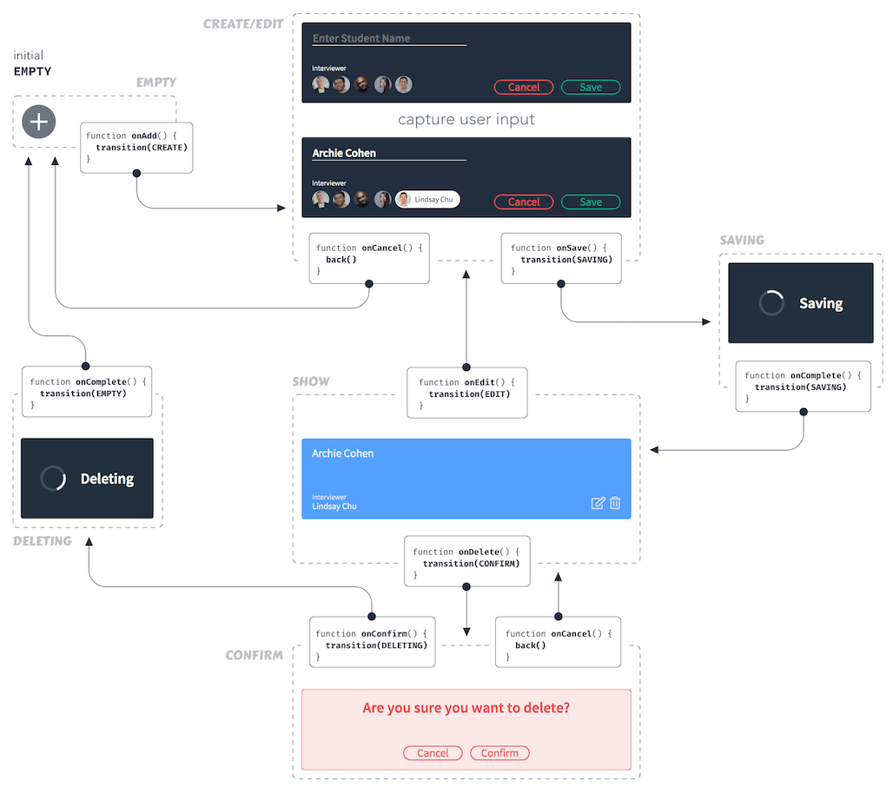
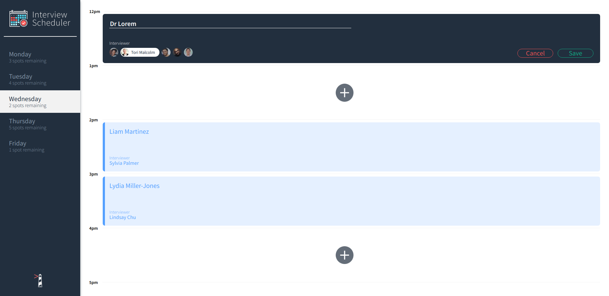

# Interview Scheduler

Scheduler is a single-page app made with React. Users can book, edit, and delete appointments with interviewers on a selection of timeslots over 5 weekdays.

Built to learn React hooks and best practices, the app is also thoroughly tested with Jest and Cypress. Scheduler connects to the [Scheduler API](https://github.com/ericos-bennett/scheduler-api) and has a WebSocket connected [Scheduler Dashboard](https://github.com/ericos-bennett/scheduler-dashboard).

##### Component Tree

##### Flow Chart

## Screenshots

##### Default Schedule View

##### Create or Edit an Interview

##### Confirm Before Deleting

## Stack

##### Front-End
- React
- SASS
- Axios

##### Back-End
- Node.js
- Express
- PostgreSQL

##### Testing
  - Jest
  - Cypress

## Getting Started

- Install all dependencies with `npm install`
- Run the Webpack Development Server with `npm start`
- Run the Jest Test Framework with `npm test`
- View the Jest coverage report with `npm run coverage`
- Open the Storybook Visual Testbed with `npm run storybook`
- Run Cypress E2E tests with `npm run cypress`
